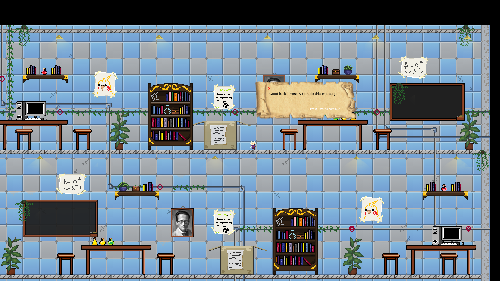
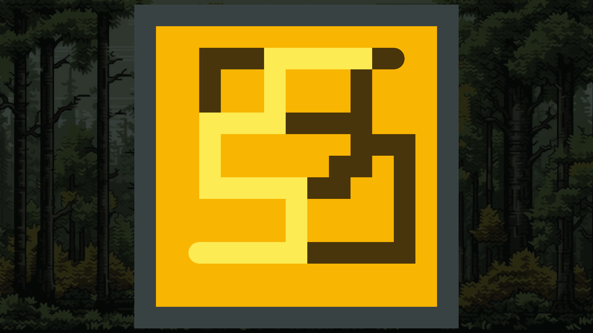
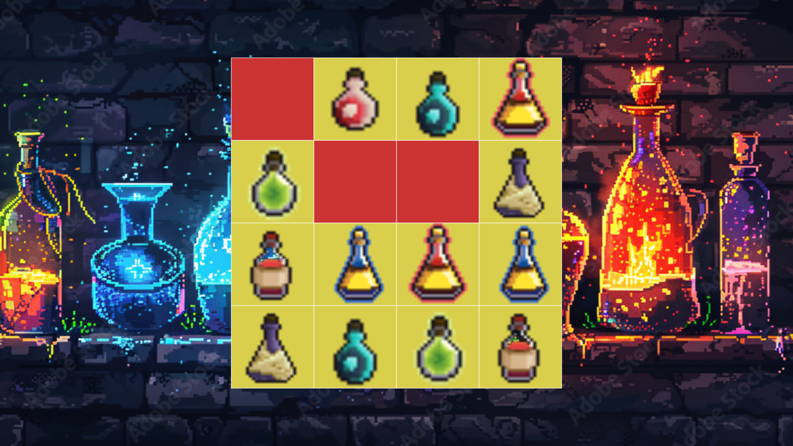

# Escape the lab 

## [informatii despre joc](https://docs.google.com/document/d/10BE9e0ffAcgKeyVexpQIpHjuUNPb9jyHqCrhBW20V-k/edit)

## structura:
  main.lua: Entry point for the game.
  assets/: Store your images, sounds, and other assets.
  scenes/: For different game states (menus, levels, game over, etc.).
  lib/: Place reusable libraries or helper functions here.
  entities/: Organize game objects (e.g., player, enemies, items).


## librarii folosite:
* [lib/gamestate](https://hump.readthedocs.io/en/latest/gamestate.html) -> switch intre scene
* [lib/camera](https://hump.readthedocs.io/en/latest/camera.html) -> librarie pentru camera
* [lib/sti](https://github.com/karai17/Simple-Tiled-Implementation) -> librarie pentru tiled maps
* [lib/classic](https://github.com/rxi/classic) -> librarie pentru oop
* [lib/anim8](https://github.com/kikito/anim8?tab=readme-ov-file) -> librarie pentru animatii
* [bump](https://github.com/kikito/bump.lua) -> libraria pentru coliziuni

## diagrams:
* [flowcharts team](https://lucid.app/lucidchart/b16d8f5d-b3fc-4da5-bbf2-558979efe23f/edit?invitationId=inv_574d863f-9582-416f-85ce-2670b04b7241)

## Tutorial:
* [Tutorial LOVE](https://sheepolution.com/learn/book/contents)
* [Tutorial Youtube](https://www.youtube.com/@Challacade)
* *-videouri cu functi si librari folosite in exemple usoare 

## Printscreens:




## Instalation:
1. Clone

```
git clone https://github.com/AlexD2003/Escape_the_lab.git
cd Escape_the_lab
```

2. Install lua/love2d

[Lua.](https://www.lua.org/download.html)\
[Love.](https://love2d.org/)

3. Run

```
love .
```